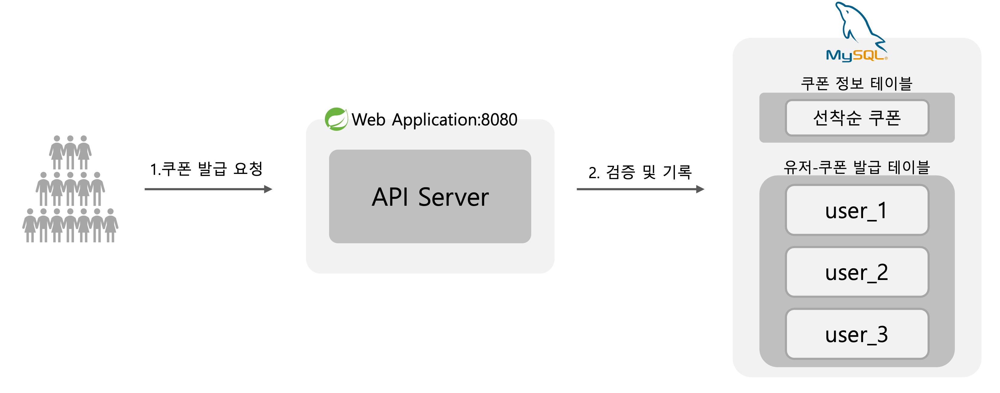
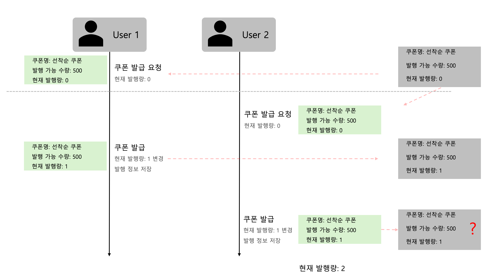
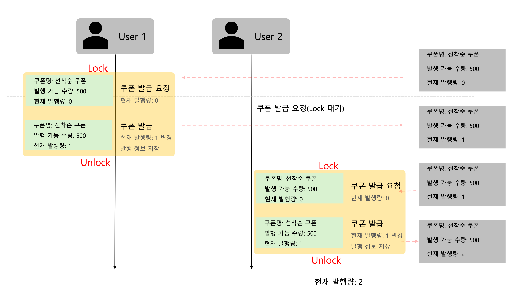
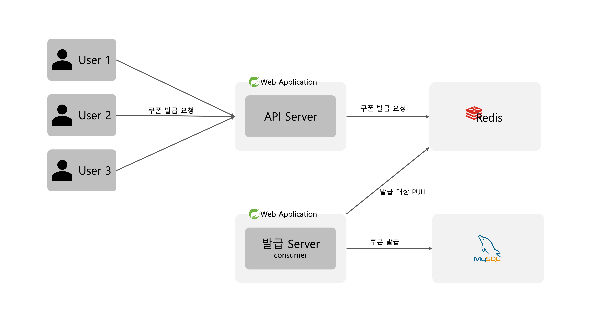

# 선착순 쿠폰 시스템
## 1. Architecture

## STEP 1. MySQL 기반의 쿠폰 발급 기능


### Issue 1) 사용자 트래픽의 증가
#### 해결방법
- API 서버의 부하 분산
  - API 서버의 Scale out
- 데이터베이스의 부하 분산
  - 캐시(읽기 작업의 경우): 레디스 서버를 두어 처리하는 역할을 두어 분산
  - 데이터베이스 서버 확장(master, slave), 샤딩 등으로 해결할 수 있음 -> 관리하기 어려움

### Issue 2) 동시성 문제의 발생
 | |
--- | --- |
- `synchronized` 키워드 사용
  - 해당 키워드는 Java Application에 종속적
  - 여러 서버로 확장된다면 lock을 제대로 관리할 수 없음
- 분산 락 사용 <Redis>
  - 여러 서버가 동일한 리소스에 동시 접근하지 못하도록 제어 가능
```java
public void execute(String lockName, long waitMilliSecond, long leaseMilliSecond, Runnable logic) {
        RLock lock = redissonClient.getLock(lockName);
        try {
            boolean isLock = lock.tryLock(waitMilliSecond, leaseMilliSecond, TimeUnit.MILLISECONDS);  // 획득 대기 시간, 획득 후 최소 소유 시간
            if (!isLock) {
                throw new IllegalStateException(String.format("[%s] lock 획득 실패", lockName));
            }
            logic.run();
        } catch (InterruptedException e) {
            log.error(e.getMessage(), e);
            throw new RuntimeException(e);
        } finally {
            if(lock.isHeldByCurrentThread()) {
                lock.unlock();
            }
        }
    }
 
```
- Row Lock(행 잠금)<MySQL>
  - 특정 행에 대해서만 Lock을 검
  - 하지만 이 방식은 DB 요청이 많아질 시에 병목이 발생할 수 있다. 확장될 수 없는 구조...
```mysql
START TRANSACTION;
SELECT * FROM coupons WHERE id = 1 FOR UPDATE;
-- 다른 트랜잭션은 이 행을 수정할 수 없음
UPDATE coupons SET issued_quantity = 1 WHERE id = 1;
COMMIT;
```
```java
public interface CouponJpaRepository extends JpaRepository<Coupon, Long> {
    @Lock(LockModeType.PESSIMISTIC_WRITE)
    @Query("SELECT c FROM Coupon c WHERE c.id = :id")
    Optional<Coupon> findCouponWithLock(long id);
}
```
## STEP 2. Redis 기반을 쿠폰 발급 기능
### 기존 방식의 문제점
- API 서버의 과부하
  1. N명의 유저가 요청을 보냄
  2. API는 N개의 요청을 처리
  3. N개의 트랜잭션 처리
     - 쿠폰 조회
     - 쿠폰 발급 내역 조회
     - 쿠폰 수량 증가 & 쿠폰 발급
#### 결론 : 서버 구조를 개선하자!!!

**쿠폰 API 서버의 분리**
- 유저 트래픽과 쿠폰 발급 트랜잭션 분리
  - Redis를 통한 트래픽 대응
  - MySQL 트래픽 제어
- 비동기 쿠폰 발급 시스템
  - Queue를 인터페이스로 발급 요청/ 발급 과정을 분리
- 쿠폰 발급 요청을 처리하는 API 서버 / 쿠폰 발급을 수행하는 발급 서버 분리
#### 분리함으로써 발생하는 문제
- MySQL의 조회없이 Redis만 사용해서 사용자 요청을 어떻게 처리해야하나?
  - 이전 방식으로는 DB에서 쿠폰 정보를 가져와 기한, 발급 수량, 중복 발급 여부를 검증했음
- Redis에 데이터를 추가하고 발급 서버에서 Polling하고 있는 구조라서 비동기로 처리될텐데 이것에 대한 동일성 검증은 어떻게?
  - 쿠폰 발급 요청을 동기로 처리할 필요는 없으므로 비동기 처리로 해도 됨
  - 다만, 레디스의 쿠폰 발급 요청 정보와, MySQL의 쿠폰 발급 요청 정보를 일치시켜야 함
### Refactoring 1) Redis Cache 적용
```java
@Cacheable(cacheNames = "coupon") // 캐시에 값이 존재하지 않을 때만 메서드를 실행하여 데이터를 조회한 뒤, 캐시에 저장
public CouponRedisEntity getCouponCache(long couponId) { // 캐시에 쿠폰 정보가 있다면 바로 반환
    Coupon coupon = couponIssueService.findCoupon(couponId); // 없다면 데이터를 호출해 가져와서 저장 후 반환
    return new CouponRedisEntity(coupon);
}
```
#### Coupon Entity를 캐싱하여 쿠폰 검증 과정에서 활용하자
- 쿠폰 발급 수량은 실시간성으로 변경되기 때문에 이 데이터로는 검증하기 힘듦 -> 따라서 해당 정보는 캐싱하지 않는다.
- 쿠폰 ID, 전체 쿠폰 발급 가능 수량, 쿠폰 시작일, 쿠폰 만료일 정보 등을 캐싱하여 사용
### Refactoring 2) Redis Set 활용하기
#### Sorted Set 사용 시 문제점
- Sorted Set은 zadd 메서드 처리시간이 logN으로 데이터가 많아질수록 처리도 오래 걸리게 된다.
- 여러 명이 동시에 요청할 경우 동일한 timestamp가 기록되는 문제점을 발견하였고, 이는 3명의 발급 대상자를 선정할 때 동일한 시간을 가진 유저를 처리하기에 애매한 상황이다.

#### 동작 구조
- Set 구조에 UserID 저장(이전에 발급받았더라도, `SISMEMBER`를 통해 O(1)로 확인 가능)
- `SCARD` 메서드로 SET 구조 안의 데이터 수를 파악하여 발급 가능 수량을 넘었는지 검증 후 `SADD`로 유저 추가
- 이후 쿠폰 발급 큐에 저장(해당 큐는 쿠폰 발급 서버에서 PULL)

#### 발생 가능한 문제) Redis에서도 동시성 문제가 발생할 수 있다?
- Redis가 싱글쓰레드로 동작한다고 해서 동시성 문제가 발생하지 않는다고 생각할 수 있다.
- 하지만 여러 서버에서 동시에 Redis를 접근하여 사용할 때 검증 단계에서 값을 조회하는 과정에 동시성 문제가 발생할 수 있다.
- 따라서 Redis와 검증할 때의 통신 과정을 락을 통해 동시성 문제를 해결해야 한다.
  
### Refactoring 3) Redis Script 활용하기
#### 문제점
- 이전 Redis의 동시성 문제 발생 가능성을 생각해 분산락으로 동시성 문제를 해결했었다.
- Redis와 통신 과정을 한 트랜잭션 내에서 동기적 여러번 처리하다보니 빠른 시간에 lock을 획득하지 못하게 되어 성능저하가 발생

#### 해결법
```java
private RedisScript<String> issueRequestScript() {
    String script = """
            if redis.call('SISMEMBER', KEYS[1], ARGV[1]) == 1 then
                return '2'
            end
                
            if tonumber(ARGV[2]) > redis.call('SCARD', KEYS[1]) then
                redis.call('SADD', KEYS[1], ARGV[1])
                redis.call('RPUSH', KEYS[2], ARGV[3])
                return '1'
            end
                
            return '3'
            """;
    return RedisScript.of(script, String.class);
}
```
- 레디스 스크립트를 작성하여 일련의 과정을 하나의 레디스 스크립트를 통해 동작하도록 설정
- 스크립트 하나는 하나의 명령어로 여러번 명렁하는 것보다 훨씬 빠른 성능을 보임

### Refactoring 4) RedisCache가 아닌 LocalCache를 통해 성능 높이기
- LocalCache를 활용한다면 레디스 캐시의 접근을 줄일 수 있음
- 이전 방식의 경우 쿠폰 발급 가능 수량을 넘었더라도, 레디스 캐시를 통해 발급 여부를 검증함
  - 캐시에 boolean으로 발급 가능 여부를 저장한다면, 레디스와 통신하지 않고 해결 가능
  - DB에 업데이트가 발생할 때 마다 캐시의 쿠폰 정보도 매번 변경해준다.
  - 평소에는 true로 발급 가능 상태였다가, 불가능이 된다면 이후 요청 처리에 대해서는 통신하지 않아도 된다.
- LocalCache에 쿠폰 캐시 정보가 없다면 Redis 메서드를 거쳐 캐시가 저장되게끔 로직 수행
